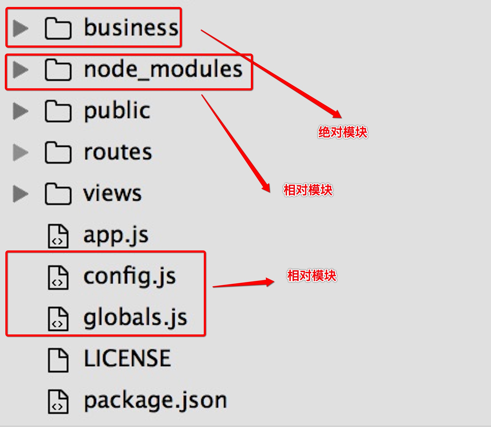

# global对象

全局对象，意味着我们能够在程序的任何一个地方访问到它。

### global

>浏览器的 window 一样 
	

### process 

>进程对象，所有全局执行上下文都在其中

```javascript

//NodeJS程序运行的端口号
process.env.PORT

```


### require
>说到 `require`，我们首先要明白NodeJS中的`模块系统`。

>NodeJS的模块系统，是作为一种工具，帮助我们能够快速构建NodeJS应用。就像JavaScript中，有Jquery一样。它主要帮我们集中解决了全局命名空间的污染以及命名冲突的问题

>NodeJS中的模块，分为`绝对模块`和`相对模块`
>其中绝对模块又分为：
* NodeJS的内置模块，如 `http`、`fs`、`url`等；在我们安装好NodeJS开发环境之后就有了
* node_modules文件夹中的模块，通过 ` npm install xxx` 安装

>相对模块是指一个相对目录中JavaScript文件或者一个相对路径的JavaScript文件，如下图：
 

> `require` 就是用来引入`绝对模块`和`相对模块`的。

```javascript

//引入绝对模块
var http = require("http");
var express = require("express");

//引入相对模块
var globals = require('./globals');
var config = require('./config');
var business_chat = require('../business/chat-tunnel-handler');

```


### module

### exports